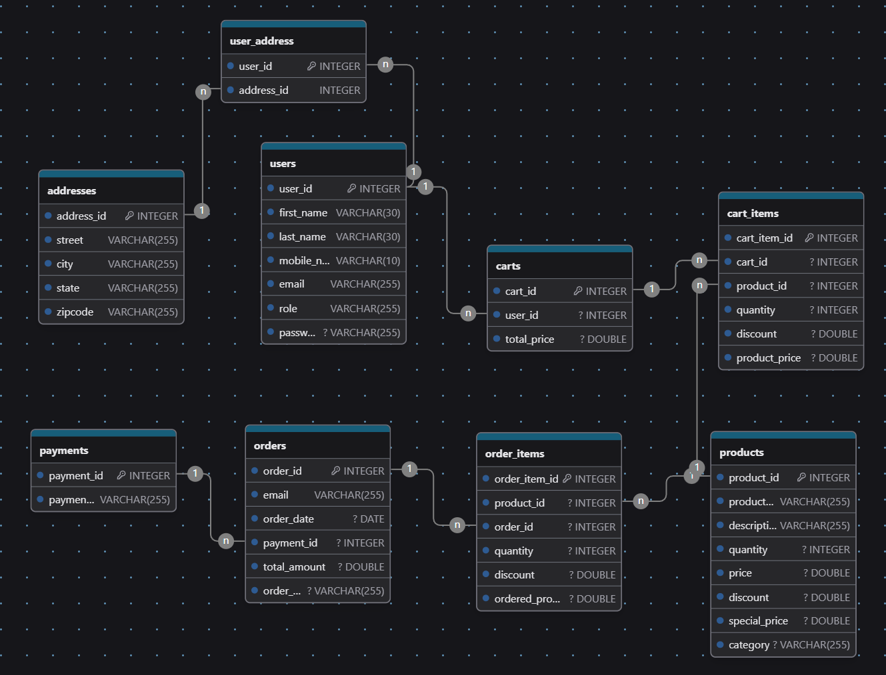
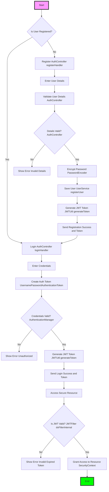
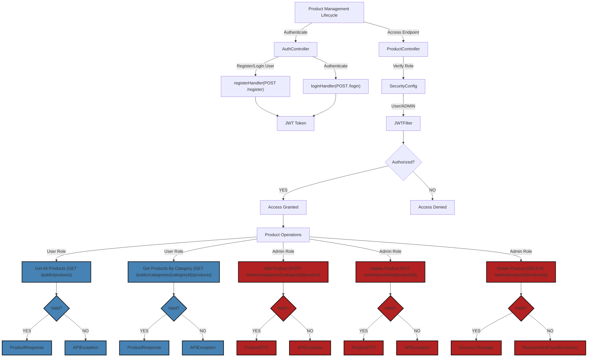
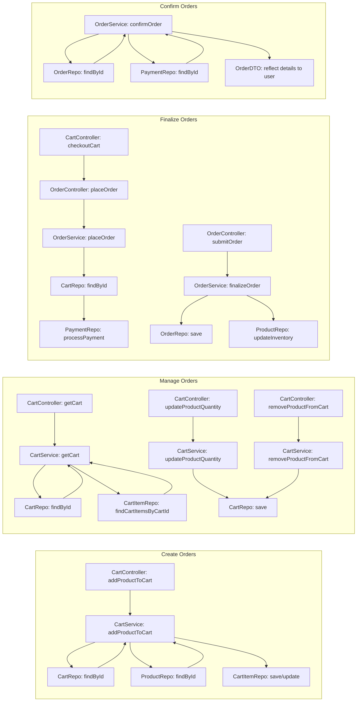

# Database Schema

## User Authentication Flowchart

```mermaid
flowchart TD
    A[Start] --> B{Is User Registered?}
    
    B -- Yes --> C[Login AuthController loginHandler]
    B -- No --> D[Register AuthController registerHandler]
    
    D --> E[Enter User Details]
    E --> F[Validate User Details AuthController]
    F --> G{Details Valid? AuthController}
    G -- No --> H[Show Error Invalid Details]
    G -- Yes --> I[Encrypt Password PasswordEncoder]
    I --> J[Save User UserService registerUser]
    J --> K[Generate JWT Token JWTUtil generateToken]
    K --> L[Send Registration Success and Token]
    L --> C
    
    C --> M[Enter Credentials]
    M --> N[Create Auth Token UsernamePasswordAuthenticationToken]
    N --> O{Credentials Valid? AuthenticationManager}
    O -- No --> P[Show Error Unauthorized]
    O -- Yes --> Q[Generate JWT Token JWTUtil generateToken]
    Q --> R[Send Login Success and Token]
    R --> S[Access Secure Resource]
    
    S --> T{Is JWT Valid? JWTFilter doFilterInternal}
    T -- No --> U[Show Error Invalid Expired Token]
    T -- Yes --> V[Grant Access to Resource SecurityContext]
    V --> W[End]

    style A fill:#f9f,stroke:#333,stroke-width:4px
    style W fill:#0f0,stroke:#333,stroke-width:4px
```

## Product Management Graph

```mermaid
graph TD
    A[Product Management Lifecycle] -->|Authenticate| B[AuthController]
    A -->|Access Endpoint| C[ProductController]

    B -->|Register/Login User| B1["registerHandler(POST /register)"]
    B1 --> J[JWT Token]
    B -->|Authenticate| B2["loginHandler(POST /login)"]
    B2 --> J

    C -->|Verify Role| D[SecurityConfig]
    D -->|User/ADMIN| E[JWTFilter]

    E --> G{Authorized?}
    G -- YES --> H[Access Granted]
    G -- NO --> I[Access Denied]

    H --> F[Product Operations]

    F -->|User Role| F1["Get All Products (GET /public/products)"]
    F1 --> Q{Valid?}
    Q -- YES --> Q1[ProductResponse]
    Q -- NO --> Q2[APIException]

    F -->|User Role| F2["Get Products By Category (GET /public/categories/{categoryId}/products)"]
    F2 --> R{Valid?}
    R -- YES --> R1[ProductResponse]
    R -- NO --> R2[APIException]

    F -->|Admin Role| F3["Add Product (POST /admin/categories/{categoryId}/product)"]
    F3 --> T{Valid?}
    T -- YES --> T1[ProductDTO]
    T -- NO --> T2[APIException]

    F -->|Admin Role| F4["Update Product (PUT /admin/products/{productId})"]
    F4 --> U{Valid?}
    U -- YES --> U1[ProductDTO]
    U -- NO --> U2[APIException]

    F -->|Admin Role| F5["Delete Product (DELETE /admin/products/{productId})"]
    F5 --> V{Valid?}
    V -- YES --> V1[Success Message]
    V -- NO --> V2[ResourceNotFoundException]

    classDef admin fill:#B22222,stroke:#000,stroke-width:2px;
    classDef user fill:#4682B4,stroke:#000,stroke-width:2px;

    class F1,F2,Q,Q1,Q2,R,R1,R2 user;
    class F3,F4,F5,T,T1,T2,U,U1,U2,V,V1,V2 admin;
```

## Order Processing Mermaid diagram

```mermaid
graph RL
    subgraph Create Orders
        A1[CartController: addProductToCart]
        A2[CartService: addProductToCart]
        A3[CartRepo: findById]
        A4[ProductRepo: findById]
        A5[CartItemRepo: save/update]
        A1 --> A2 --> A3 & A4 --> A2
        A2 --> A5
    end
    
    subgraph Manage Orders
        B1[CartController: getCart]
        B2[CartService: getCart]
        B3[CartRepo: findById]
        B4[CartItemRepo: findCartItemsByCartId]
        B1 --> B2 --> B3 & B4 --> B2

        B5[CartController: updateProductQuantity]
        B6[CartService: updateProductQuantity]
        B7[CartController: removeProductFromCart]
        B8[CartService: removeProductFromCart]
        B9[CartRepo: save]
        B5 --> B6 --> B9
        B7 --> B8 --> B9
    end
    
    subgraph Finalize Orders
        C1[CartController: checkoutCart]
        C2[OrderController: placeOrder]
        C3[OrderService: placeOrder]
        C4[CartRepo: findById]
        C5[PaymentRepo: processPayment]
        C1 --> C2 --> C3 --> C4 --> C5
    
        C6[OrderController: submitOrder]
        C7[OrderService: finalizeOrder]
        C8[OrderRepo: save]
        C9[ProductRepo: updateInventory]
        C6 --> C7 --> C8 & C9
    end
    
    subgraph Confirm Orders
        D1[OrderService: confirmOrder]
        D2[OrderRepo: findById]
        D3[PaymentRepo: findById]
        D4[OrderDTO: reflect details to user]
        D1 --> D2 & D3 --> D1 
        D1 --> D4
    end
```